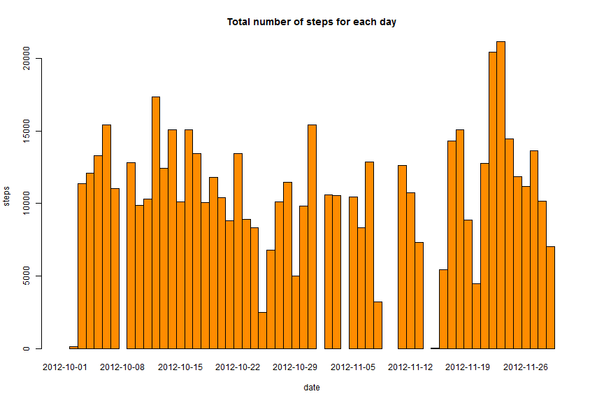
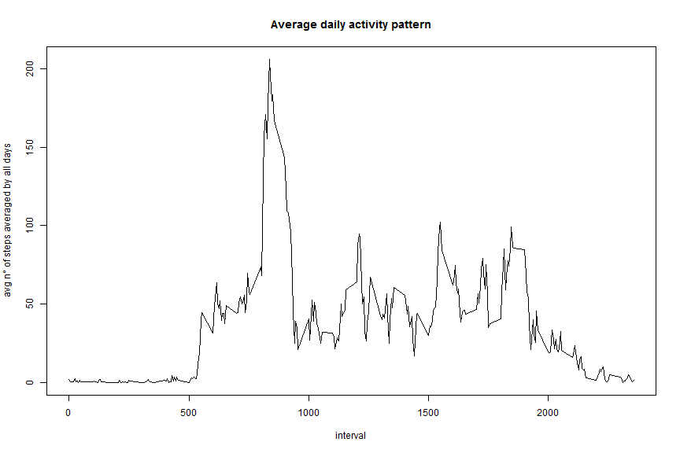
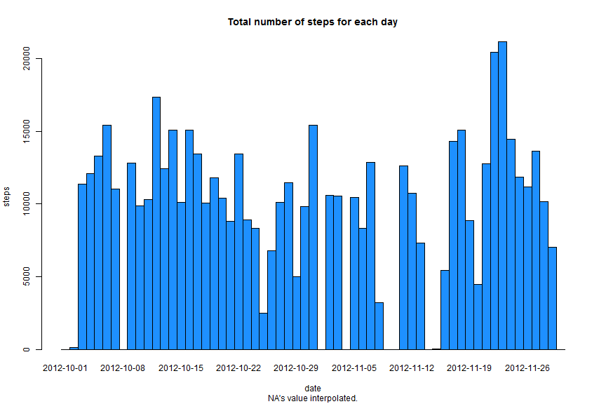
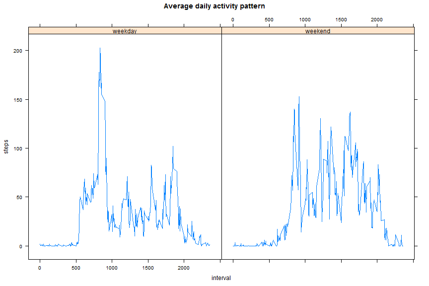

# Reproducible Research: Peer Assessment 1

This assignment makes use of data from a personal activity monitoring device.
This device collects data at 5 minute intervals through out the day. 
The data consists of two months of data from an anonymous individual collected during the months of October and November, 2012 and include the number of steps taken in 5 minute intervals each day.

The dataset is already present in the repository (*file* **activity.zip**). There's no need to download it.

## Loading and preprocessing the data

- The datasets is zipped. It must be `unz`-ipped before read the CSV file.

```r
data <- read.csv(unz("activity.zip", "activity.csv"))
data$date <- as.Date(data$date, format ="%Y-%m-%d")
```

- The dataset is composed by

```r
dim(data)
```

```
## [1] 17568     3
```

```r
summary(data)
```

```
##      steps            date               interval   
##  Min.   :  0.0   Min.   :2012-10-01   Min.   :   0  
##  1st Qu.:  0.0   1st Qu.:2012-10-16   1st Qu.: 589  
##  Median :  0.0   Median :2012-10-31   Median :1178  
##  Mean   : 37.4   Mean   :2012-10-31   Mean   :1178  
##  3rd Qu.: 12.0   3rd Qu.:2012-11-15   3rd Qu.:1766  
##  Max.   :806.0   Max.   :2012-11-30   Max.   :2355  
##  NA's   :2304
```


## What is mean total number of steps taken per day?

- Aggregate steps data by date


```r
steps <- aggregate(data$steps, by=list(data$date), FUN=sum)
names(steps) <- c("date", "steps")
```

- This is the resulting histogram of the aggregate data


```r
barplot(steps$steps, names.arg=steps$date, col=c("darkorange"), main="Total number of steps for each day", xlab="date", ylab="steps", space=0)
```

 

- The mean and median (respectively) total number of steps taken per day, removing missing values


```r
steps.mean <- mean(steps$steps, na.rm=TRUE)
sprintf( "Mean = %.2f",steps.mean)
```

```
## [1] "Mean = 10766.19"
```

```r
steps.median <- median(steps$steps, na.rm=TRUE)
sprintf( "Median = %.2f", steps.median)
```

```
## [1] "Median = 10765.00"
```


## What is the average daily activity pattern?

- Average of aggregate data interval by date


```r
x <- unique(data$interval)
s <- (split(data, data$interval))
y <- sapply(names(s), FUN=function(x) {mean(s[[x]]$steps, na.rm=T)})
plot(x,y, type='l', main="Average daily activity pattern", xlab="interval", ylab="avg n° of steps averaged by all days")
```

 

- Which 5-minute interval, on average across all the days in the dataset, contains the maximum number of steps?

```r
df <- data.frame(x,y)
names(df) <- c("interval","avg.steps")
df[df$avg.steps == max(df$avg.steps),]
```

```
##     interval avg.steps
## 835      835     206.2
```


## Imputing missing values

- Total NA's value

```r
dim(data) - dim(na.omit(data))
```

```
## [1] 2304    0
```

- Interpolating missing values

```r
require(zoo)
```

```
## Loading required package: zoo
## 
## Attaching package: 'zoo'
## 
## The following objects are masked from 'package:base':
## 
##     as.Date, as.Date.numeric
```

```r
df <- data
df$steps <- na.approx(data$steps, na.rm=F, rule=2)
dim(df)
```

```
## [1] 17568     3
```

```r
summary(df)
```

```
##      steps            date               interval   
##  Min.   :  0.0   Min.   :2012-10-01   Min.   :   0  
##  1st Qu.:  0.0   1st Qu.:2012-10-16   1st Qu.: 589  
##  Median :  0.0   Median :2012-10-31   Median :1178  
##  Mean   : 32.5   Mean   :2012-10-31   Mean   :1178  
##  3rd Qu.:  0.0   3rd Qu.:2012-11-15   3rd Qu.:1766  
##  Max.   :806.0   Max.   :2012-11-30   Max.   :2355
```
As you can see in the two summaries from the dataset, the steps' mean is different:
- Original = 37.3826
- Interpolated NA's value = 32.48

And dimensions are the same: 17568, 3

Are the dimension of the two datasets identical? 

`dim(df) == dim(data)` => TRUE, TRUE

- Aggregate steps data by date with new dataset


```r
stepsi <- aggregate(df$steps, by=list(df$date), FUN=sum)
names(stepsi) <- c("date", "steps")
barplot(stepsi$steps, names.arg=stepsi$date, col=c("dodgerblue"), main="Total number of steps for each day",sub="NA's value interpolated.", xlab="date", ylab="steps", space=0)
```

 

- The mean and median (respectively) total number of steps taken per day, with interpolated missing values


```r
stepsi.mean <- mean(stepsi$steps)
sprintf( "Mean = %.2f", stepsi.mean)
```

```
## [1] "Mean = 9354.23"
```

```r
stepsi.median <- median(stepsi$steps)
sprintf( "Median = %.2f", stepsi.median)
```

```
## [1] "Median = 10395.00"
```

#### Do these values differ from the estimates from the first part of the assignment? 
These values differ from the original:

```
- Mean 
     Original     = 10766.19
     Interpolated = 9354.23
  
-  Median 
     Original     = 10765.00
     Interpolated = 10395.00
```


#### What is the impact of imputing missing data on the estimates of the total daily number of steps?

The impact is graphically almost the same.

The mean and median are little smaller and it means that people maybe have done less steps for each day.


## Are there differences in activity patterns between weekdays and weekends?


```r
#Setting approriate Locale for "matching" week of days
Sys.setlocale("LC_TIME","English, United States")
```

```
## [1] "English_United States.1252"
```

- Summaries on days (weekend and weekday)


```r
length(df$date)
```

```
## [1] 17568
```

```r
weekend <- weekdays(df$date) == "Sunday" | weekdays(df$date) == "Saturday"
sum(weekend)
```

```
## [1] 4608
```

```r
#sum(weekdays(df$date) == "Monday" | weekdays(df$date) == "Tuesday"  | weekdays(df$date) == "Wednesday" | weekdays(df$date) == "Thursday" | weekdays(df$date) == "Friday")
length(df$date) - sum(weekend)
```

```
## [1] 12960
```

- Adding factor column for type of day (levels: "weekday","weekend")


```r
dfw <- cbind(df,factor(weekend, labels=c("weekday","weekend")))
names(dfw)[4] <- "daytype"
head(dfw)
```

```
##   steps       date interval daytype
## 1     0 2012-10-01        0 weekday
## 2     0 2012-10-01        5 weekday
## 3     0 2012-10-01       10 weekday
## 4     0 2012-10-01       15 weekday
## 5     0 2012-10-01       20 weekday
## 6     0 2012-10-01       25 weekday
```


```r
require(lattice)
```

```
## Loading required package: lattice
```

```r
x <- unique(dfw$interval)
sw <- (split(dfw, dfw$interval))

ywe <- sapply(names(sw), FUN=function(x) {mean(sw[[x]]$steps[sw[[x]]$daytype=="weekend"], na.rm=T)})
ywd <- sapply(names(sw), FUN=function(x) {mean(sw[[x]]$steps[sw[[x]]$daytype=="weekday"], na.rm=T)})

yweb <- cbind(ywe, TRUE)
ywdb <- cbind(ywd, FALSE)
ywb <- rbind(yweb,ywdb)
ywb <- data.frame(rep(x,2), ywb, check.names=F, check.rows=F, row.names=NULL)

names(ywb) <- c("interval","steps","daytype")
ywb$daytype <- factor(ywb$daytype, labels=c("weekday","weekend"))

xyplot(steps~interval | daytype, data=ywb, type="l", main="Average daily activity pattern")
```

 

